# Citation-Constellation

**Where Do Your Citations Come From?**

A free, open-source, no-code, and auditable tool for citation network decomposition with complementary BARON and HEROCON scores.

[](https://citation-constellation.serve.scilifelab.se)
[](https://mit-license.org/)
[](https://www.python.org/downloads/release/python-3110/)
[](https://hub.docker.com/r/mahbub1969/citation-constellation)

---

## What Is This?

Citation-Constellation decomposes a researcher's citation profile by **network proximity** between citing and cited authors. Standard metrics like the h-index treat all citations as equal — a citation from an independent researcher carries the same weight as one from a direct co-author or departmental colleague. This tool makes the invisible structure visible.

Enter an **ORCID** or **OpenAlex ID** and receive a full multi-layer citation network decomposition within minutes. No installation, no registration, no payment required.

**Try it now:** [citation-constellation.serve.scilifelab.se](https://citation-constellation.serve.scilifelab.se)

---

## The Two Scores

### BARON (Boundary-Anchored Research Outreach Network)

A strict binary metric. Every citation is either **inside** the researcher's network (0 points) or **outside** (1 point). No partial credit.

```
BARON = (External citations ÷ Classifiable citations) × 100
```

### HEROCON (Holistic Equilibrated Research Outreach CONstellation)

A graduated weighted metric. In-group citations receive partial credit based on relationship proximity.

```
HEROCON = (Σ weights ÷ Classifiable citations) × 100
```

### The Gap

```
Gap = HEROCON − BARON
```

| Gap Size | Interpretation |
|----------|---------------|
| < 3% | Most citations are fully external |
| 3–10% | Meaningful inner-circle contribution, external impact dominant |
| > 10% | Significant portion of impact from the collaborative network |

The gap is neither good nor bad. It characterizes citation *structure*, not quality.

> **Important:** BARON and HEROCON measure citation network structure, not research quality, impact, or integrity. They should **not** be used for hiring, promotion, or funding decisions.

---

## Classification Hierarchy

Citations are classified using a strict priority order (first match wins):

| Priority | Classification | Phase | Description | BARON | HEROCON Weight |
|----------|---------------|-------|-------------|-------|----------------|
| 1 | SELF | 1 | Researcher is an author on the citing work | 0 | 0.0 |
| 2 | DIRECT_COAUTHOR | 2 | Citing author shared ≥1 publication with target | 0 | 0.2 |
| 3 | TRANSITIVE_COAUTHOR | 2 | Co-author of a co-author | 0 | 0.5 |
| 4 | SAME_DEPT | 3 | Same department, no co-authorship | 0 | 0.1 |
| 5 | SAME_INSTITUTION | 3 | Same university, different department | 0 | 0.4 |
| 6 | SAME_PARENT_ORG | 3 | Shared parent in ROR hierarchy | 0 | 0.7 |
| 7 | UNKNOWN | 3 | Insufficient metadata | excluded | excluded |
| 8 | EXTERNAL | 3 | No detected relationship | 1 | 1.0 |

HEROCON weights are **experimental heuristics**, not empirically calibrated values. Custom weights can be provided via CLI or the web interface.

---

## Detection Phases

Each phase adds a detection layer. Later phases incorporate all earlier layers.

| Phase | Detection Layer | Classes | Status |
|-------|----------------|---------|--------|
| **1** | Self-citation (author ID match) | 2 | ✅ Available |
| **2** | Co-author network (BFS graph traversal, depth 1–3, temporal decay) | 4 | ✅ Available |
| **3** | Temporal affiliation matching (ROR hierarchy) | 7 | ✅ Available |
| **4** | Venue governance (local LLM extraction of editorial boards) | 11 | 🔧 Building |
| **5** | Field normalization and percentile ranks | — | 📋 Planned |

---

## Quick Start

### Option 1: Web Interface (Recommended)

No installation required. Go to **[citation-constellation.serve.scilifelab.se](https://citation-constellation.serve.scilifelab.se)** and:

1. Enter an ORCID (e.g., `0000-0002-1101-3793`) or OpenAlex ID (e.g., `A0000000000`). Full URLs are accepted.
2. Optionally set a career start year, adjust co-author graph depth (default: 2), enable manual validation of flagged papers, or upload custom HEROCON weights.
3. Click **Run Analysis**. Expect 1–4 minutes for ~50–100 publications.
4. Explore results: score summary, classification donut chart, co-author network graph, career trajectory, full citation table with per-citation rationale.
5. Download the JSON audit report for offline analysis or comparison.

**Rate limit:** 10 analyses per hour per session. Visualization of existing audit files has no limit.

**Comparing researchers:** Upload multiple audit JSON files in the **View Existing Audits** tab for side-by-side comparison tables and overlaid trajectory charts (up to 115 simultaneous comparisons).

### Option 2: Command-Line Interface

```bash
git clone https://github.com/citation-cosmograph/citation-constellation.git
cd citation-constellation
pip install -r requirements.txt

# Full analysis (recommended)
python phase3.py --orcid 0000-0002-1101-3793 --trajectory

# Also accepts OpenAlex IDs
python phase3.py --openalex-id A0000000000 --trajectory
```

**Requirements:** Python 3.11+. No database needed for Phases 1–3.

### Option 3: Docker

```bash
# Prebuilt image (recommended)
docker pull mahbub1969/citation-constellation:v1
docker run --rm -it -p 7860:7860 mahbub1969/citation-constellation:v1

# Or build from source
docker build -t citation-constellation:v0.3 .
docker run --rm -it -p 7860:7860 citation-constellation:v0.3
```

Open `http://localhost:7860`.

### Option 4: Run Web App Locally with Python

```bash
cd citation-constellation/
pip install -r app/requirements.txt
python app/main.py
# Open http://localhost:7860
```

---

## CLI Reference

### Phase Scripts

| Phase | Script | What It Detects |
|-------|--------|----------------|
| 1 | `phase1.py` | Self-citations only → BARON v0.1 |
| 2 | `phase2.py` | + Co-author network → BARON v0.2 + HEROCON v0.2 |
| 3 | `phase3.py` | + Institutional affiliations → BARON v0.3 + HEROCON v0.3 |

**Phase 3 is recommended** for the most comprehensive analysis.

### Common Flags

| Flag | Description |
|------|-------------|
| `--orcid ID` | Researcher ORCID identifier |
| `--openalex-id ID` | OpenAlex author ID |
| `--since YEAR` | Exclude works published before this year |
| `--depth 1\|2\|3` | Co-author graph depth (default: 2) |
| `--trajectory` / `-t` | Compute cumulative career trajectory (required for trajectory chart in web viz) |
| `--confirm` / `-c` | Interactive review of ORCID-flagged works before scoring |
| `--herocon-weights FILE` | Custom HEROCON weight configuration (JSON) |
| `--export FILE` | Export summary to JSON |
| `--no-orcid-check` | Skip ORCID cross-validation |
| `--no-audit` | Skip audit file generation (not recommended) |
| `--verbose` / `-v` | Verbose output |

### Full Example

```bash
python phase3.py \
    --orcid 0000-0002-1101-3793 \
    --since 2010 \
    --depth 2 \
    --trajectory \
    --confirm \
    --herocon-weights weights.json \
    --export results.json
```

### Custom HEROCON Weights

Create a JSON file with any subset of classifications. Unspecified classifications use defaults.

```json
{
    "SELF": 0.0,
    "DIRECT_COAUTHOR": 0.3,
    "TRANSITIVE_COAUTHOR": 0.6,
    "SAME_DEPT": 0.2,
    "SAME_INSTITUTION": 0.5,
    "SAME_PARENT_ORG": 0.8,
    "EXTERNAL": 1.0
}
```

### Interactive Confirmation Mode

```bash
python phase3.py --orcid 0000-0002-1101-3793 --confirm
```

The tool displays ORCID-flagged works with reasons and prompts for a decision. Input: `all` (exclude all), `none` (keep all), `1,3,5` (exclude specific items), or `1-3,5` (ranges).

---

## Demo

### Ethical Notice

Every analysis output begins with a prominent ethical disclaimer, reinforcing that BARON and HEROCON measure citation network structure, not research quality, impact, or integrity.

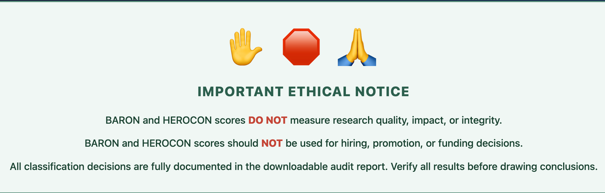

### Score Panel

The score panel presents BARON and HEROCON scores alongside key summary statistics: total citations, classifiable citations, the BARON–HEROCON gap, and a data quality reliability rating.

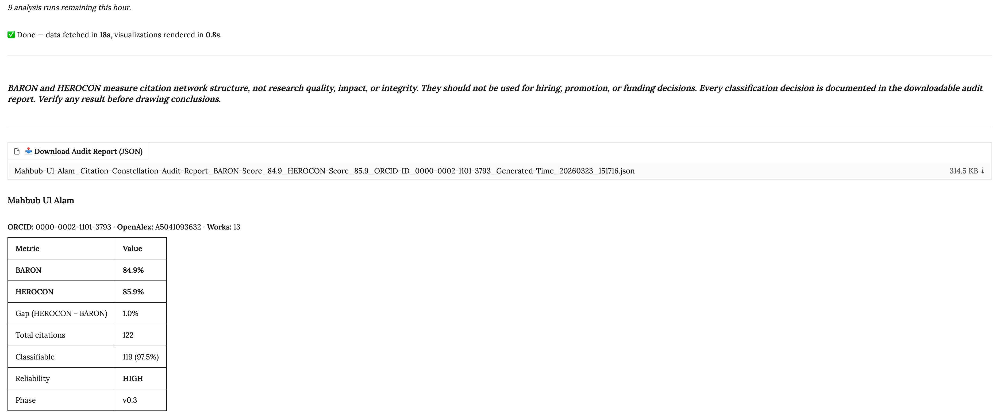

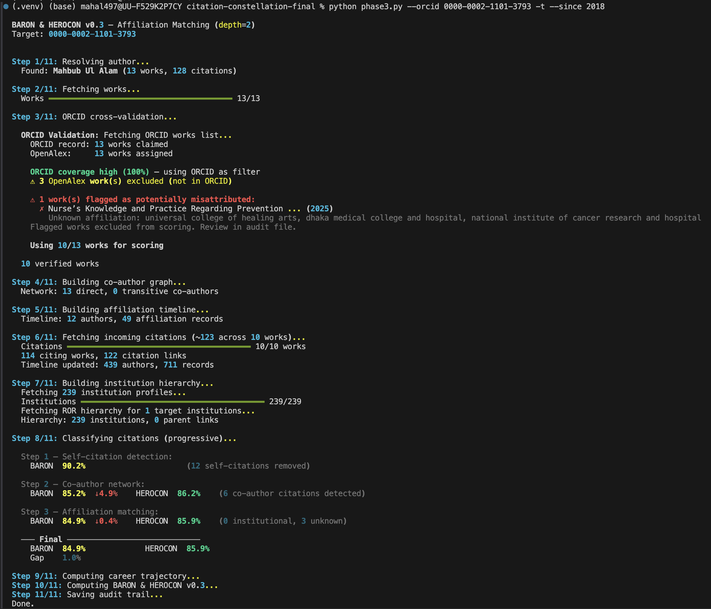

### Classification Breakdown

The donut chart provides a proportional breakdown of citation origins across all classification categories, with BARON and HEROCON scores displayed in the center.

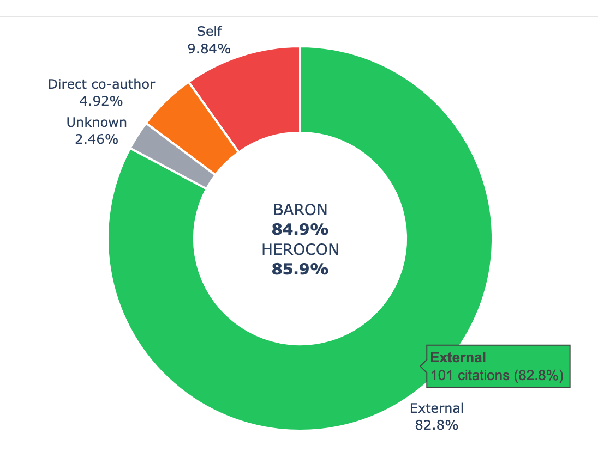

### Classification Summary

Each citation category with its count, percentage of classifiable citations, and the HEROCON weight applied.

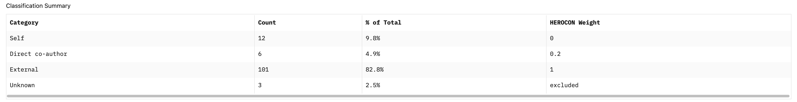

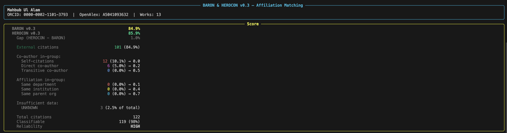

### Co-Author Network Graph

Interactive force-directed network. The target researcher appears as a gold node, direct co-authors in crimson (sized by shared publications), and transitive co-authors in blue. Hover any node for details. Networks exceeding 150 nodes are automatically pruned.

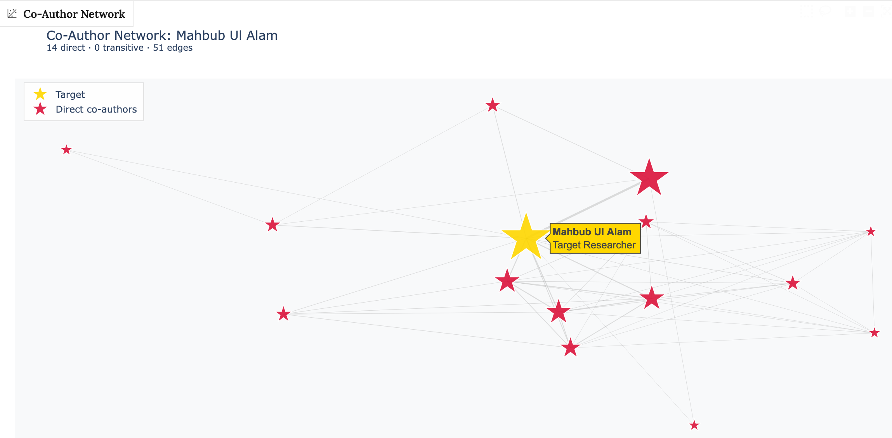

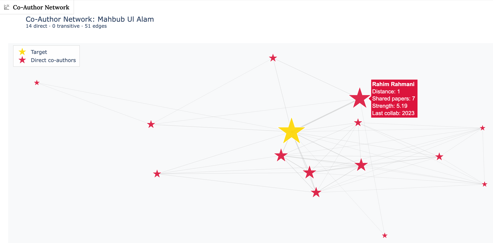

### Career Trajectory

Cumulative BARON and HEROCON scores over time as dual lines, with a shaded region representing the gap. Stacked bars beneath show annual citation volume.

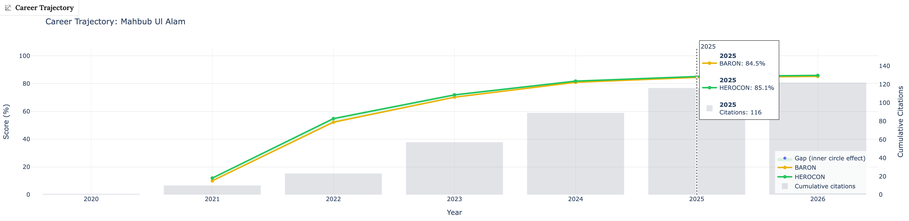

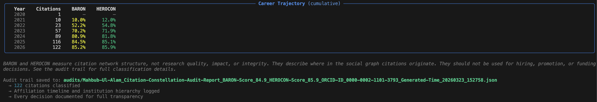

### Citation Table

Every individual citation with its classification, confidence level, detection phase, and a human-readable rationale. This is the audit trail made visible — any classification can be inspected and contested.

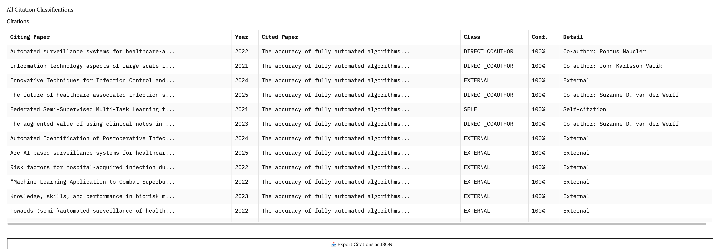

### Comparison View

Side-by-side structural analysis of multiple researchers from uploaded audit files. Researcher names below are anonymized.

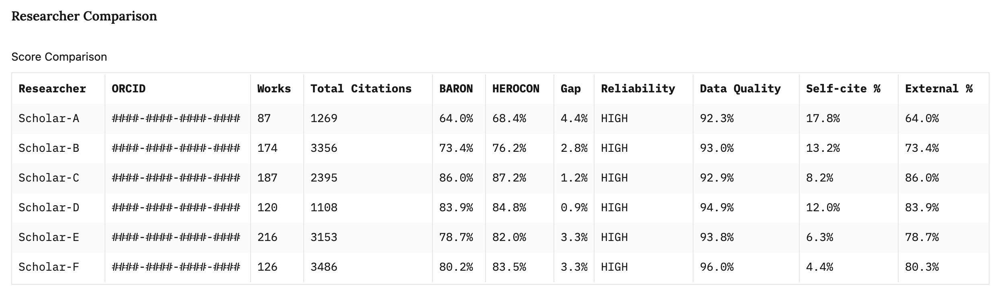

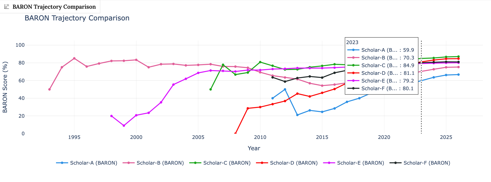

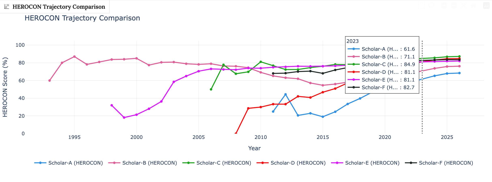

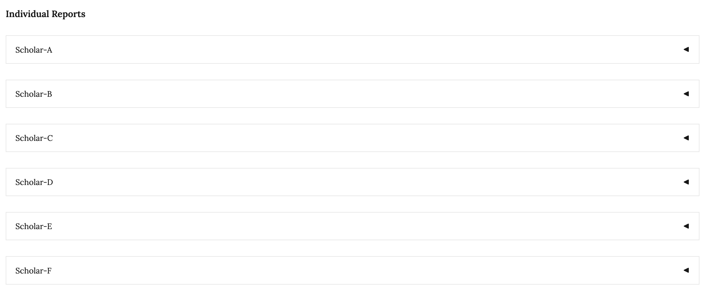

---

## Output & Visualizations

Both CLI and web interface produce identical scores and audit trails. The web interface additionally renders:

- **Score Summary** — BARON, HEROCON, gap, total/classifiable citations, reliability rating
- **Classification Donut Chart** — Proportional breakdown with scores in center
- **Co-Author Network Graph** — Interactive force-directed graph (gold = target, crimson = direct co-authors, blue = transitive)
- **Career Trajectory Chart** — Dual-line BARON/HEROCON over time with shaded gap area
- **Full Citation Table** — Every citation with classification, confidence, phase, and human-readable rationale
- **Comparison View** — Side-by-side analysis from multiple uploaded audit files

### Audit Trail

Every run generates a timestamped JSON audit file in `./audits/` documenting:

- Researcher profile and all works analyzed
- Every citation link and classification decision with human-readable rationale
- Co-author graph (nodes, edges, distances, collaboration strength)
- Affiliation timeline and ROR institution hierarchy
- ORCID validation results
- Score breakdown and career trajectory data

CLI-generated audit files can be uploaded to the web interface for visualization without re-running computation.

> **Note:** Include `--trajectory` / `-t` when generating audit files via CLI if you want the career trajectory chart in the web interface. All other visualizations work regardless.

---

## Data Quality & Reliability

Citations with insufficient metadata are classified as **UNKNOWN** and excluded from both BARON and HEROCON denominators, preventing missing data from artificially inflating or deflating scores.

| Quality (% classifiable) | Rating | Interpretation |
|--------------------------|--------|----------------|
| ≥ 85% | HIGH | Scores are trustworthy |
| ≥ 70% | MODERATE | Reasonable, treat with care |
| ≥ 50% | LOW | Significant data gaps |
| < 50% | VERY LOW | Too much missing data for reliable scoring |

---

## ORCID Cross-Validation

The tool cross-validates OpenAlex works against ORCID records using a smart two-mode system:

- **High ORCID coverage (≥70%):** ORCID is a hard filter — only works in both ORCID and OpenAlex enter scoring.
- **Low ORCID coverage (<70%):** All OpenAlex works kept, but affiliation anomaly detection flags suspicious works.

If the publication span exceeds 25 years, a warning suggests using `--since YEAR`.

---

## Choosing Graph Depth

| Depth | In-group definition | Best for |
|-------|-------------------|----------|
| 1 | Direct co-authors only | Large, loosely connected fields |
| 2 | + Co-authors of co-authors (default) | Most researchers |
| 3 | + Three hops | Small, tightly-knit fields |

Higher depth → larger in-group → lower BARON score.

---

## Handling Name Collisions

OpenAlex occasionally merges works from different researchers with similar names. Signs: publication span warning (>25 years), unexpected institutions, inflated publication count.

**Solutions:**
1. Use `--since YEAR` to exclude pre-career publications
2. Use `--confirm` to interactively review and exclude misattributed works
3. Ensure the researcher's ORCID profile is up to date (≥70% coverage enables hard filtering)

---

## The Citation-Cosmograph Ecosystem

> `pulsar` → `astrolabe` → `constellation`
> *the signal — the instrument — the map*

| Component | Purpose | Links |
|-----------|---------|-------|
| **Citation-Constellation** | BARON & HEROCON scoring | [Live Tool](https://citation-constellation.serve.scilifelab.se) · [Source](https://github.com/citation-cosmograph/citation-constellation) |
| **Citation-Pulsar-Helm** | LLM inference on Kubernetes | [Source](https://github.com/citation-cosmograph/citation-pulsar-helm) |
| **Citation-Astrolabe** | Venue governance database | [Source](https://github.com/citation-cosmograph/citation-astrolabe) |

[github.com/citation-cosmograph](https://github.com/citation-cosmograph)

---

## Technology Stack

- **Language:** Python 3.11+
- **CLI:** Typer, Rich, httpx
- **Web Interface:** Gradio
- **Phase 4 (in development):** SQLite/PostgreSQL, Qwen 3.5 8B (Q4_K_M via llama.cpp on Kubernetes)
- **Data Sources (all free and open):** OpenAlex (260M+ works, 100M+ authors, 2.8B+ citation links), ORCID Public API v3.0, ROR API v2, Cloudflare Crawl API (Phase 4)

**Performance:** For ~80 publications and ~1,500 citations, Phase 3 completes in under 90 seconds with ~100–150 OpenAlex API calls.

---

## Future Roadmap

### Phase 4: Venue Governance Detection (In Development)

Detects citations from venues where the researcher or their network holds editorial/committee roles. Uses a locally deployed LLM (Qwen 3.5 8B) to extract structured governance data from venue websites. Four new classification types: `VENUE_SELF_GOVERNANCE` (weight 0.05), `VENUE_EDITOR_COAUTHOR` (0.15), `VENUE_EDITOR_AFFIL` (0.3), `VENUE_COMMITTEE` (0.4).

### Phase 5: Field Normalization & Percentiles (Planned)

Field-normalized percentile ranks against peer cohorts (same field, career length, publication volume). Confidence intervals via bootstrap resampling. REST API for programmatic access.

### Phase 6: Validation & Advanced Diagnostics (Future)

Sensitivity analysis of HEROCON weights, UNKNOWN imputation strategies, ground-truth cross-validation against citation motivation surveys, rolling temporal trajectories, multi-source data fusion (Semantic Scholar, CrossRef, DBLP), and empirical weight calibration.

---

## Limitations

- **Coverage bias:** OpenAlex is English-heavy and recent-heavy. Older or non-English publications may have lower coverage.
- **Small-field problem:** In small communities, nearly everyone is a co-author's co-author at depth 2, producing low BARON scores that reflect field size, not citation practice.
- **HEROCON weights are experimental:** Not empirically calibrated. Diverse profiles are robust to perturbation; concentrated profiles are sensitive.
- **UNKNOWN creates a conditioned sample:** If UNKNOWN citations are systematically different from classifiable ones, computed scores reflect a biased subset.
- **Correlation, not causation:** A DIRECT_COAUTHOR citation may be genuinely content-motivated. The tool detects structural potential for network-mediated citation, not actuality.
- **Department-level matching is noisy:** ROR lacks department-level identifiers for most institutions.

---

## Phased Implementation Architecture Diagram
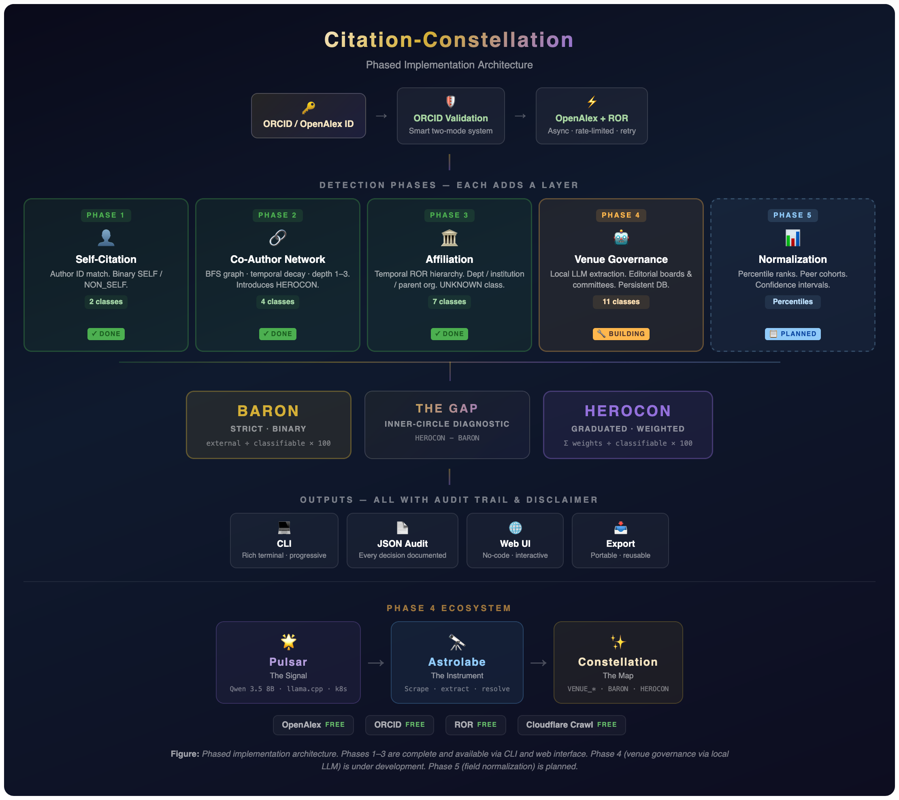

---

## Paper

For the full methodology, conceptual foundations, tool landscape comparison, discussion of responsible research assessment alignment, and detailed limitations analysis, see the accompanying research paper:

**"Where Do Your Citations Come From? Citation-Constellation: A Free, Open-Source, No-Code, and Auditable Tool for Citation Network Decomposition with Complementary BARON and HEROCON Scores"**

Mahbub Ul Alam. SciLifeLab Data Centre, Uppsala University, Sweden.

The paper is also available embedded within the web tool under the **Full Research Paper** tab.

### BibTeX

```bibtex
@article{alam2026citation-constellation,
    title     = {Where Do Your Citations Come From? {Citation-Constellation}: A Free,
                 Open-Source, No-Code, and Auditable Tool for Citation Network
                 Decomposition with Complementary {BARON} and {HEROCON} Scores},
    author    = {Alam, Mahbub Ul},
    year      = {2026},
    note      = {Preprint / manuscript. Available at
                 \url{https://citation-constellation.serve.scilifelab.se}},
    url       = {https://github.com/citation-cosmograph/citation-constellation}
}
```

*(BibTeX entry will be updated with DOI and venue details upon publication.)*

---

## Acknowledgements

Built on [SciLifeLab Serve](https://serve.scilifelab.se). Powered by [OpenAlex](https://openalex.org), [ORCID](https://orcid.org), and [ROR](https://ror.org).

---

## License

MIT
